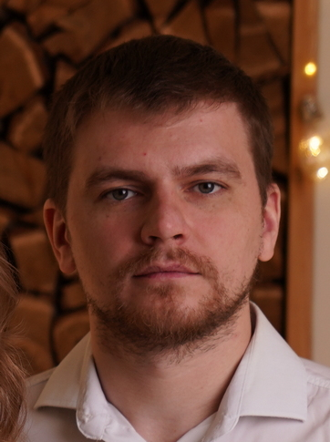

      

<!DOCTYPE html>
<html>
<head>

</head>
<body>

<h2>Котькин Максим Викторович</h2>

<h4>Желаемая должность: младший разработчик, junior 
Желаемый доход: 120 тыс. рублей 
Дата рождения: 17.02.1991 
Проживание: г. Саранск 
Готовность к переезду: да</h4>

<h4>Контактная информация:</h4>
Телефон: +7(951)058-89-25 
Электронная почта: set.91@mail.ru

<h4>Ключевые знания и навыки:</h4>
 - опыт управления персоналом; 
 - коммуникабельность; 
 - пунктуальность; 
 - умение быстро разбираться в новых направлениях;
 
<h4>Достижения:</h4>
 - разработка тренажерно-тестирующей системы для МГПИ им. М.Е. Евсевьева на языке Visual Studio;
 
<h4>Опыт работы:</h4>
04.20 - н.в. Управляющий сети магазинов "Вкусновар" 
ИП Чиряскин А.А., г. Саранск 
Сфера деятельности: продажа товаров для винокуров и сыроделов. 
 - Формирование заказов; 
 - Логистика грузов и товаров; 
 - Прием/списание товаров; 
 - управление персоналом. 
  

04.18 - 12.20 Индивидуальный предприниматель 
ИП Котькин М.В., г. Саранск 
Сфера деятельности: деятельность кафе, баров, ресторанов. 
 - управление персоналом; 
 - формирование бюджета; 
 - формирование заказов; 
 - создание контента для соц.сетей. 
  
 
02.17 - 02.18 Торговый представитель 
ООО "Мясокомбинат "Оброченский", с. Баево 
Сфера деятельности: розничная продажа мясных изделий. 
 - поиск клиентов; 
 - сбор заказов; 
 - конроль исполнения; 
  

02.2016 - 10.2016 Ведущий инженер 
ООО MAYKOR, г. Саранск 
Сфера деятельности: IT-аутсорсинг 
 - конроль линий ШПД; 
 - устранение повреждений; 
 - коммутационные работы на станциях связи; 
 - ведение отчетности; 
 - конроль персонала. 
  
 
 04.15 - 09.15 Техник строений и сооружений 
 ФГУП "Ростехинвентаризация - Федеральное БТИ", г. Саранск 
 Сфера деятельности: Услуги по технической инвентаризации недвижимости. 
  - прием заявок; 
  - выдача заключений; 
  - выезд на замеры; 
  - составление технических паспортов; 
   
  
11.12 - 03.15 Продавец - консультант 
Сеть цифровых супермаркетов "DNS", г. Саранск 
Сфера деятельности: продажа компьютерной и бытовой техники. 
 - консультация клиентов; 
 - работа с юр.лицами; 
 - временная замена управляющего магазином; 
  
 
<h4>Образование:</h4>
11.2021 - н.в. институт "Нетология" 
Курс: Разработчик Android 
 

09.08 - 07.13 МГПИ им М.Е. Евсевьева, г. Саранск 
Факультет: Физико-математический. 
Специальность: Учитель "Информатики". 
 

09.06 - 06.08 МОУ "Старошайговская средняя школа №2" 
09.97 - 06.06 МОУ "Старошайговская средняя школа №1" 
 

<h4>Дополнительная информация:</h4>
Владение языками: 
Английский язык: А2 
Мокшанский язык: B2 
 
Знание ПК: Windows, MS Office, сборка-настройка ПК, знание комплектующих. 

 
 

</body>
</html>
